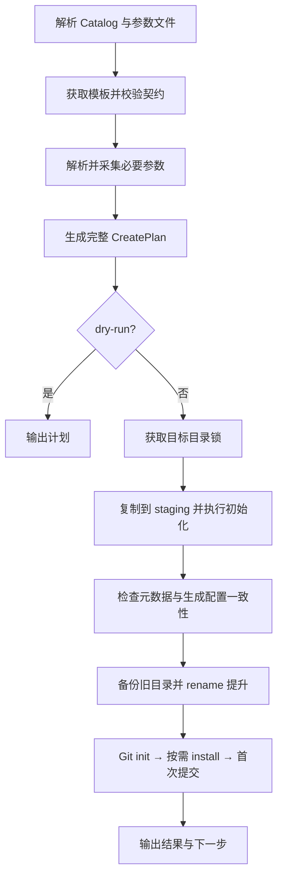

# 架构与维护

0.7.0 把参数解析、项目生成与终端呈现分开，核心生成器通过 AbortSignal、阶段回调、日志回调和输入采集回调与命令层协作。核心模块不导入交互组件，可用于非交互调用和独立回归测试。

| 模块                                        | 职责                                                               |
| ------------------------------------------- | ------------------------------------------------------------------ |
| `cli.ts`                                    | Commander 参数与命令注册、统一错误/退出码、SIGINT/SIGTERM 生命周期 |
| `commands/create.ts`                        | 模板/方式选择、只询问未提供的字段、结果展示、配置导出              |
| `ui/reporter.ts`、`theme.ts`                | TTY/CI 判断、spinner、颜色、stderr 诊断、JSON 错误                 |
| `core/project-input.ts`、`validation.ts`    | 参数优先级与合并、名称/端口/URL/契约/扩展字段校验                  |
| `core/template-source.ts`                   | 来源选择、Git/tar 获取、大小限制、主备源切换、来源追踪             |
| `core/template-cache.ts`                    | 缓存元数据、事务更新、列表/清理与读取快照协调                      |
| `core/project-generator.ts`                 | CreatePlan、staging、输出一致性、目录替换、Git/安装                |
| `utils/fs.ts`、`file-lock.ts`、`process.ts` | 安全复制、原子 JSON、目录锁、子进程停止/超时/有界日志              |

## 生命周期与恢复点

目录提升是恢复语义的边界：之前失败/取消会清理 staging，旧目标保留；之后失败保留新项目，并提供 targetRoot/generated 恢复信息。已有目录替换采用备份 rename，再提升，失败时恢复；这不是跨多个文件系统操作的 ACID 事务。强制终止或断电可能留下 staging/backup，文档明确说明这一限制。

初始提交失败为警告，Git 仓库仍可使用；其他生成后的操作失败设置非零退出码。参数导出失败同样明确报告已生成目录，避免用户误以为创建未发生。

## 缓存一致性与性能

下载和解压在缓存目录旁的唯一 staging 内进行，耗时获取不占用缓存锁。校验通过后记录大小、模板版本和 commit/hash，再在短写入临界区替换缓存条目。异常时恢复旧条目，清理不影响在途下载。

读取持有缓存锁完成契约校验与独立快照复制，然后释放锁。调用者仅使用快照，因此后续刷新/清理不会改变其文件。当前使用一个缓存根目录锁，优先保证跨平台一致性；大型模板同时读取仍会等待快照复制，可在出现实测争用后考虑不可变版本目录与引用计数，避免提前增加生命周期复杂度。

大小只在发布缓存时统计一次。新格式命中和列表直接读取 sizeBytes；旧缓存缺少字段时，列表可回退统计。HTTP tar 流式传输，200 MB 压缩/1 GB 解压/100000 条目限制分别保护下载和解压阶段。子进程输出保留有界尾部，避免日志无限占用内存。

安全复制保留文件权限和内部相对链接，不遍历符号链接目录；排除依赖、构建产物、旧 Git 和默认元数据。远程模板复制成快照，本地模板在生成时复制；本地源仍应由使用者避免同时修改，CLI 不锁定第三方工作区。

## 取消与子进程

一个 AbortController 贯穿交互、下载、缓存等待、复制和子进程。SIGINT/SIGTERM 转换为退出码 130/143；第二次信号立即结束。交互组件只负责呈现，实际取消由执行层检查。spinner 自行绘制单行进度，保持 stdin 的普通终端模式，让键盘 Ctrl+C 正常触发 SIGINT；没有使用 Clack 内部会直接 exit(0) 的输入 blocker。

子进程等待 close 事件，以确保输出已关闭。Unix 通过独立进程组终止子树，Windows 使用 taskkill；超时或取消先终止，必要时升级停止。Windows 仅固定包管理器命令经过 cmd.exe，模板入口通过 Node 和参数数组调用。默认 stdin 关闭，避免模板或 Git 凭据在 CI 中等待输入。

实现依据可参阅 [Node 子进程文档](https://nodejs.org/docs/latest-v24.x/api/child_process.html)、[pnpm install](https://pnpm.io/cli/install) 与 [node-tar 文档](https://github.com/isaacs/node-tar)。实际边界由回归测试固定，包括 close/延迟日志、超时、取消和目录清理。

## 测试与发布

`tests/fixtures/pc`、`mobile` 是最小契约模板，不复制企业工程依赖。覆盖真实 CLI 输出、参数优先级、扩展参数约束、未知能力、入口遵循、事务失败、内部/外部链接、缓存并发/损坏/离线、文件锁恢复、tar 限制和 Git/安装顺序。

`pnpm check`：格式 → 类型 → 测试 → 构建。`pnpm test:terminal` 通过 Python 3 的真实 PTY 覆盖 spinner/选择阶段键盘 Ctrl+C、默认名确认、窄终端和已提供字段跳过。`pnpm test:package` 验证 npm 打包内容，将 tarball 安装到独立临时工程，通过打包后的 bin 执行版本、help、JSON 配置及完整创建，并检查元数据。它需要 npm 公开依赖网络，但不发布包。

CI 使用 macOS/Linux/Windows × Node 22.13/24。Unix SIGINT 集成用例在 Windows 跳过，跨平台 AbortSignal 与超时用例仍执行。CI 定义不是本机已验证所有系统的证明，应以远端 job 结果为准。

## 后续扩展准则

- 新增模板通过 Catalog 和 Manifest，避免在 UI 中硬编码技术栈、环境数量或启动命令。
- 新增能力优先扩展 features/parameters，并提供独立 fixture 或失败用例。
- 修改缓存必须保持“验证后写入、读取使用快照、清理与发布协调”的约束。
- 修改生成流程须明确目录提升前后失败语义；所有子进程必须有超时并接收 AbortSignal。
- 需要完全可复现时固定 Git tag/commit 所对应的受控 Ref，并保留项目 provenance；移动分支和可变下载 URL 仍可能在下次刷新变化。
